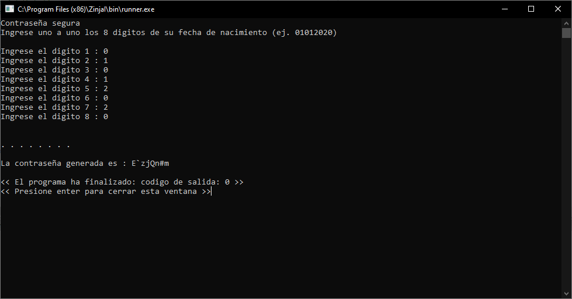

#PWDGEN
Este algoritmo esta enfocado a todas aquellas personas que tienen problemas para recordar sus contraseñas.

La base de trabajo es tomar un codigo de 8 digitos, como la fecha de cumpleaños pero sin limitarse a ello, y generar una contraseña.

Para obtener la contraseña cada vez, solo es necesario correr el programa.

